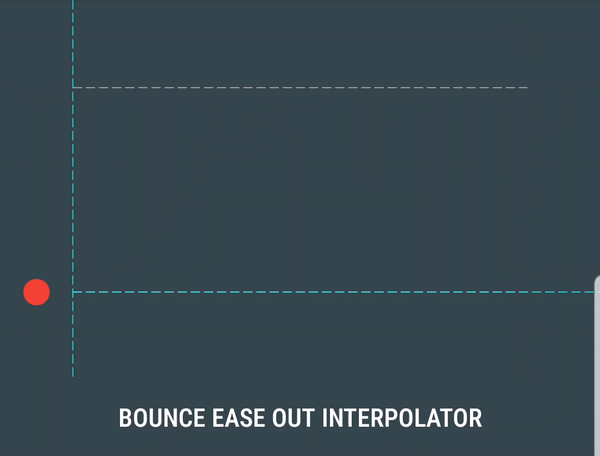

# Easing and Splines for UI Animations

The UI of a game is one of the the most important parts that can influence the User Experience for our players. It is also an element that appears almost in every part of our game, from the start of the game, while in the middle of gameplay, to its final scene.

That's the main reason why it is a good idea to improve the UX in our game, starting by the UI!

By using Easing Functions and Splines you can easily give life to the movements and animations of your UI.

## What are those _Easing Functions_ and _Splines_?

### About _Easing Functions_:

As redundant as it may sound, _Easing functions_ are _functions_ that let us control the "speed" of a certain movement within a certain time and duration:


<p align="center">
  
</p>

_Circular Out easing type_

<p align="center">
  
</p>

_Bounce Out easing type_

<p align="center">
  
</p>

_Back Out easing type_


### Splines

A spline is a line controlled by a what are called <b>control points</b>, and its shape follows their position by interpolating from one point to another using polynomials. 

<p align="center">
  
</p>

_Spline Example (in red) formed by two other functions (magenta and green)_

There are many advanced mathematics involved in making these ([paper explaining](https://people.cs.clemson.edu/~dhouse/courses/405/notes/splines.pdf)), but the results are remarkable!

They are used in science and mathematics, but they are also applicable to entertainment, such as animation, music and videogames!

<p align="center">
  
</p>

<p align="center">
  
</p>

## Usage in Videogames

Well, we know what they are, but how are these things used in videogames?

### Splines in Videogames

A we have seen, splines are very useful when it comes to joining points smoothly. This is particularly useful at the time of making paths of any type, as it can imitate a very organic and fluid movement (as the fish shown earlier).

Similarly, we can use its capabilities to make literal paths. As shown in the next [footage](https://www.youtube.com/watch?v=saAQNRSYU9k), by using a spline defined by some points and a preset of a floor tile, we can make a roadway with a low amount of resources!

### Easing Functions

As shown, easing functions serve to control the speed of a movement. This is an easy explanation, but it can extrapolate to many uses!

For example, we can make some very interesting effects to props and characters in both 2D and 3D games:

<p align="center">
  
</p>

_Geometry Dash: Easings avaiable in level editor_

<p align="center">
  
  
</p>

_Roblox: linear vs elastic easing_


Now, when it comes to UI, they can also be applied. And it also creates many interesting effects!:

<p align="center">
  
</p>

<p align="center">
  
</p>

<p align="center">
  
</p>

## Now, practice time!

Now we know the theory about what are easings and splines. Nice! But now is time to work with it a bit.

In this repository we will be working on easings and their range of possibilities. To do so we will use a library named [tweeny.h](https://mobius3.github.io/tweeny/doc/tweeny_8h_source.html), a simple library that will let us use easings in an easy way.

In my case, we use a different style of coding than the one that tweeny.h uses. Therefore I will create a class that let us create tweens from tweeny.h and access their information through some functions to make our lifes easier:

```

class Tween
{
public:
    Tween();
    Tween(float multiplier, float smoothness, bool suppressCallbacks);
    ~Tween();

    //Set the initial conditions of the tween (start, end, time(ms) and type of easing)
    void Set(int start, int finish, int time, Easings easingMode)
    {
        totalTweenings = 1;
        currentTweening = 1;
        tween = tweeny::from(start).to(finish * smoothness).during(time);
        nextPos = finish;
        totalLength += nextPos;
        switch (easingMode)
        {
        case DEF:
            tween.via(tweeny::easing::def);
            break;
        case LINEAR:
            tween.via(tweeny::easing::linear);
            break;
        case STEPPED:
            tween.via(tweeny::easing::stepped);
            break;
        case QUADRATIC_IN:
            tween.via(tweeny::easing::quadraticIn);
            break;
        case QUADRATIC_OUT:
            tween.via(tweeny::easing::quadraticOut);
            break;
        case QUADRATIC_IN_OUT:
            tween.via(tweeny::easing::quadraticInOut);
            break;
        case CUBIC_IN:
            tween.via(tweeny::easing::cubicIn);
            break;
        case CUBIC_OUT:
            tween.via(tweeny::easing::cubicOut);
            break;
        case CUBIC_IN_OUT:
            tween.via(tweeny::easing::cubicInOut);
            break;
        case QUARTIC_IN:
            tween.via(tweeny::easing::quarticIn);
            break;
        case QUARTIC_OUT:
            tween.via(tweeny::easing::quarticOut);
            break;
        case QUARTIC_IN_OUT:
            tween.via(tweeny::easing::quarticInOut);
            break;
        case QUINTIC_IN:
            tween.via(tweeny::easing::quinticIn);
            break;
        case QUINTIC_OUT:
            tween.via(tweeny::easing::quinticOut);
            break;
        case QUINTIC_IN_OUT:
            tween.via(tweeny::easing::quinticInOut);
            break;
        case SINUSOIDAL_IN:
            tween.via(tweeny::easing::sinusoidalIn);
            break;
        case SINUSOIDAL_OUT:
            tween.via(tweeny::easing::sinusoidalOut);
            break;
        case SINUSOIDAL_IN_OUT:
            tween.via(tweeny::easing::sinusoidalInOut);
            break;
        case EXPONENTIAL_IN:
            tween.via(tweeny::easing::exponentialIn);
            break;
        case EXPONENTIAL_OUT:
            tween.via(tweeny::easing::exponentialOut);
            break;
        case EXPONENTIAL_IN_OUT:
            tween.via(tweeny::easing::exponentialInOut);
            break;
        case CIRCULAR_IN:
            tween.via(tweeny::easing::circularIn);
            break;
        case CIRCULAR_OUT:
            tween.via(tweeny::easing::circularOut);
            break;
        case CIRCULAR_IN_OUT:
            tween.via(tweeny::easing::circularInOut);
            break;
        case BOUNCE_IN:
            tween.via(tweeny::easing::bounceIn);
            break;
        case BOUNCE_OUT:
            tween.via(tweeny::easing::bounceOut);
            break;
        case BOUNCE_IN_OUT:
            tween.via(tweeny::easing::bounceInOut);
            break;
        case ELASTIC_IN:
            tween.via(tweeny::easing::elasticIn);
            break;
        case ELASTIC_OUT:
            tween.via(tweeny::easing::elasticOut);
            break;
        case ELASTIC_IN_OUT:
            tween.via(tweeny::easing::elasticInOut);
            break;
        case BACK_IN:
            tween.via(tweeny::easing::backIn);
            break;
        case BACK_OUT:
            tween.via(tweeny::easing::backOut);
            break;
        case BACK_IN_OUT:
            tween.via(tweeny::easing::backInOut);
            break;
        default:
            tween.via(tweeny::easing::def);
            break;
        }
    }

    void Set()
    {
        totalTweenings = 1;
        currentTweening = 1;
        tween = tweeny::from(0).to(0 * smoothness).during(1).via(tweeny::easing::def);
        nextPos = 0;
        totalLength += nextPos;
    }

    //Set the initial conditions of the next tween (length, time(ms) and type of easing)
    void AddTween(int duration, int time, Easings easingMode)
    {
        
        float currentPoint = tween.progress() * tween.duration();

            tween.to((duration) * smoothness).during(time);


        tween.seek((int32_t)currentPoint, false);

        switch (easingMode)
        {
        case DEF:
            tween.via(tweeny::easing::def);
            break;
        case LINEAR:
            tween.via(tweeny::easing::linear);
            break;
        case STEPPED:
            tween.via(tweeny::easing::stepped);
            break;
        case QUADRATIC_IN:
            tween.via(tweeny::easing::quadraticIn);
            break;
        case QUADRATIC_OUT:
            tween.via(tweeny::easing::quadraticOut);
            break;
        case QUADRATIC_IN_OUT:
            tween.via(tweeny::easing::quadraticInOut);
            break;
        case CUBIC_IN:
            tween.via(tweeny::easing::cubicIn);
            break;
        case CUBIC_OUT:
            tween.via(tweeny::easing::cubicOut);
            break;
        case CUBIC_IN_OUT:
            tween.via(tweeny::easing::cubicInOut);
            break;
        case QUARTIC_IN:
            tween.via(tweeny::easing::quarticIn);
            break;
        case QUARTIC_OUT:
            tween.via(tweeny::easing::quarticOut);
            break;
        case QUARTIC_IN_OUT:
            tween.via(tweeny::easing::quarticInOut);
            break;
        case QUINTIC_IN:
            tween.via(tweeny::easing::quinticIn);
            break;
        case QUINTIC_OUT:
            tween.via(tweeny::easing::quinticOut);
            break;
        case QUINTIC_IN_OUT:
            tween.via(tweeny::easing::quinticInOut);
            break;
        case SINUSOIDAL_IN:
            tween.via(tweeny::easing::sinusoidalIn);
            break;
        case SINUSOIDAL_OUT:
            tween.via(tweeny::easing::sinusoidalOut);
            break;
        case SINUSOIDAL_IN_OUT:
            tween.via(tweeny::easing::sinusoidalInOut);
            break;
        case EXPONENTIAL_IN:
            tween.via(tweeny::easing::exponentialIn);
            break;
        case EXPONENTIAL_OUT:
            tween.via(tweeny::easing::exponentialOut);
            break;
        case EXPONENTIAL_IN_OUT:
            tween.via(tweeny::easing::exponentialInOut);
            break;
        case CIRCULAR_IN:
            tween.via(tweeny::easing::circularIn);
            break;
        case CIRCULAR_OUT:
            tween.via(tweeny::easing::circularOut);
            break;
        case CIRCULAR_IN_OUT:
            tween.via(tweeny::easing::circularInOut);
            break;
        case BOUNCE_IN:
            tween.via(tweeny::easing::bounceIn);
            break;
        case BOUNCE_OUT:
            tween.via(tweeny::easing::bounceOut);
            break;
        case BOUNCE_IN_OUT:
            tween.via(tweeny::easing::bounceInOut);
            break;
        case ELASTIC_IN:
            tween.via(tweeny::easing::elasticIn);
            break;
        case ELASTIC_OUT:
            tween.via(tweeny::easing::elasticOut);
            break;
        case ELASTIC_IN_OUT:
            tween.via(tweeny::easing::elasticInOut);
            break;
        case BACK_IN:
            tween.via(tweeny::easing::backIn);
            break;
        case BACK_OUT:
            tween.via(tweeny::easing::backOut);
            break;
        case BACK_IN_OUT:
            tween.via(tweeny::easing::backInOut);
            break;
        default:
            tween.via(tweeny::easing::def);
            break;
        }
    }
    //Waits a certain amount of time(ms) before entering the next tween
    void Wait(int time)
    {
        tween.to(nextPos).during(time);
    }
    //Updates the tween in whole positions. Returns the current point of the tween
	int Step(int amount, bool suppressCallbacks)
	{
		return tween.step(amount, suppressCallbacks);
        this->suppressCallbacks = suppressCallbacks;
	}
    //Updates the tween in percentages. Returns the current point of the tween
    int Step(float amount, bool suppressCallbacks)
    {
        return tween.step(amount, suppressCallbacks);
    }
    // Returns the current point of the tween without updating it.
	float GetPoint()
	{

		return (float)tween.peek() * multiplier / smoothness;
	}
    void SetEasing(Easings easingMode)
    {
        switch (easingMode)
        {
        case DEF:
            tween.via(tweeny::easing::def);
            break;
        case LINEAR:
            tween.via(tweeny::easing::linear);
            break;
        case STEPPED:
            tween.via(tweeny::easing::stepped);
            break;
        case QUADRATIC_IN:
            tween.via(tweeny::easing::quadraticIn);
            break;
        case QUADRATIC_OUT:
            tween.via(tweeny::easing::quadraticOut);
            break;
        case QUADRATIC_IN_OUT:
            tween.via(tweeny::easing::quadraticInOut);
            break;
        case CUBIC_IN:
            tween.via(tweeny::easing::cubicIn);
            break;
        case CUBIC_OUT:
            tween.via(tweeny::easing::cubicOut);
            break;
        case CUBIC_IN_OUT:
            tween.via(tweeny::easing::cubicInOut);
            break;
        case QUARTIC_IN:
            tween.via(tweeny::easing::quarticIn);
            break;
        case QUARTIC_OUT:
            tween.via(tweeny::easing::quarticOut);
            break;
        case QUARTIC_IN_OUT:
            tween.via(tweeny::easing::quarticInOut);
            break;
        case QUINTIC_IN:
            tween.via(tweeny::easing::quinticIn);
            break;
        case QUINTIC_OUT:
            tween.via(tweeny::easing::quinticOut);
            break;
        case QUINTIC_IN_OUT:
            tween.via(tweeny::easing::quinticInOut);
            break;
        case SINUSOIDAL_IN:
            tween.via(tweeny::easing::sinusoidalIn);
            break;
        case SINUSOIDAL_OUT:
            tween.via(tweeny::easing::sinusoidalOut);
            break;
        case SINUSOIDAL_IN_OUT:
            tween.via(tweeny::easing::sinusoidalInOut);
            break;
        case EXPONENTIAL_IN:
            tween.via(tweeny::easing::exponentialIn);
            break;
        case EXPONENTIAL_OUT:
            tween.via(tweeny::easing::exponentialOut);
            break;
        case EXPONENTIAL_IN_OUT:
            tween.via(tweeny::easing::exponentialInOut);
            break;
        case CIRCULAR_IN:
            tween.via(tweeny::easing::circularIn);
            break;
        case CIRCULAR_OUT:
            tween.via(tweeny::easing::circularOut);
            break;
        case CIRCULAR_IN_OUT:
            tween.via(tweeny::easing::circularInOut);
            break;
        case BOUNCE_IN:
            tween.via(tweeny::easing::bounceIn);
            break;
        case BOUNCE_OUT:
            tween.via(tweeny::easing::bounceOut);
            break;
        case BOUNCE_IN_OUT:
            tween.via(tweeny::easing::bounceInOut);
            break;
        case ELASTIC_IN:
            tween.via(tweeny::easing::elasticIn);
            break;
        case ELASTIC_OUT:
            tween.via(tweeny::easing::elasticOut);
            break;
        case ELASTIC_IN_OUT:
            tween.via(tweeny::easing::elasticInOut);
            break;
        case BACK_IN:
            tween.via(tweeny::easing::backIn);
            break;
        case BACK_OUT:
            tween.via(tweeny::easing::backOut);
            break;
        case BACK_IN_OUT:
            tween.via(tweeny::easing::backInOut);
            break;
        default:
            tween.via(tweeny::easing::def);
            break;
        }
    }

    //Go to a certain point of the tween while interpolating
    int GoTo(int point,bool suppressCallbacks)
    {
        return tween.seek(point, suppressCallbacks);
        
    }

    //Go to a certain percentage of the tween with interpolation
    int GoTo(float point, bool suppressCallbacks)
    {
        return tween.seek(point, suppressCallbacks);
    }

    //Go to a certain point of the tween while NOT interpolating
    int JumpTo(int tweenPos, bool suppressCallbacks)
    {
        return tween.jump(tweenPos, suppressCallbacks);
    }

    void Foward()
    {
        tween.forward();
    }

    void Backward()
    {
        tween.backward();
    }

    float Progress()
    {
        return tween.progress();
    }

    uint32_t TotalDuration()
    {
        
        return tween.duration();
    }
    
    int Direction()
    {
        return tween.direction();
    }
    

    tweeny::tween<int> Main() const
    {
        return tween;
    }

public:
    float multiplier;
    float smoothness;
    bool suppressCallbacks;
private:
	tweeny::tween<int> tween;
    int nextPos;
    int totalLength;
    int accumDuration;
    int totalTweenings;
    int currentTweening;
};

```
..ok, maybe that's a bit too much. Let's start by the beginning:

tweeny.h let us create a tween. This tween can be from one to multiple points. The basic is one point, which is initialized like ```  tweeny::tween<int> tweenName; ```. From the premise that we will use a simple tween, we can access its following functions:

```
tween.from();
tween.to();
tween.via();
```
These will do the basic functions of a tween:

```
tween.from(0).to(200).during(300).via(tweeny::easing::linear);
```

This line will tell the tween to start at point 0 and end in the point 100 in a time of 300 (not in ms). To do this it will use a linear function. If we attach the value to a image moving it would result a movement with constant speed until it reaches the end.

In order to update the twee, you will need to use ```tween.step(_,false)```. Fill an integer to advance a certain amount of points, or a float if you want to advance in percentages. In this case is ```tween.step(1,false)```.

<p align="center">
  
</p>

You can extrapolate the movement to any length by using ```tween.point() * length``` .

By changing ```linear``` by any other easing will change the movement easing. Easy! 

You can concatenate tweens one after another by using:
```
tween.from(0).to(200).during(300).via(tweeny::easing::linear).to(400).during(100).via(tweeny::easing::back_in).to(300).during(200).via(tweeny::easing::linear)...
```
The code above will make a tween from 0 to 100 via linear, then to 400 via back in and then go back to 300 linearly.

You can also control the direction of the movement by using ```.foward()``` to make the movement be positive (it is by default) and ```.backward()``` to make the movement be negative (it will stop at the start of the movement). You can check the direction by using ```.direction()``` which will return 1 or -1 depending on the current direction.

To check at which point the tween is you can use ```tween.peek()```. Fill in a integer to know the point at a certain time, or fill in a float to know the point in a certain percentage.

To check at which current percentage a tween is you can use ```tween.progress```, and to check its duration, use ```tween.duration()``` .

You can also make the tween go to a certain point in its way by using ```tween.jump()```. As usual, use an int or a float depending if you want to go to a certain point or percentage.

These are the basic elements of a tween. In the header I made, I simplified those elements as:

``` Tween tween``` to create a tween.

``` tween.Set()``` to set the starting tween sequence. Let empty to initialize from 0 to 0 during 1 with a linear easing.

``` tween.AddTween()``` to add a sequence, imitating the ```.to(x).during(x).via(tweeny::easing::x)``` element.

``` tween.Wait()``` to wait for a certain amount of time. For now it is bugged, but can be achieved by using ``` tween.AddTween(currentPoint, timeToWait, easingMode)```, where the easing does not matter.

``` tween.Step()``` to step. It works the same way as the original, with the same arguments.

``` tween.GetPoint()``` to get the current point of the tween.

``` tween.SetEasing()``` to set the easing of the next tween. It can be used to change easing dynamically on the run.

``` tween.GoTo()``` is the equal to seek() and has the same arguments, as well as ``` tween.Foward()```, ``` tween.Backward()```, ``` tween.TotalDuartion()``` and ``` tween.Direction()```.

```tween.Main()``` lets the user access to the main Tweeny::tween<int> element from the tweeny library. This is useful to do more complex stuff.

Also, Tweening.h has its own list of all easings avaiable on tweeny.h, but easier to access.

Additionally, Tweening.h has the possibility to change the smoothness of a tween by doing ``` tween.smoothness = x```. This is particularly useful in long tweenings, when if let alone, the movements seem to jump from frame to frame. This also affects at the moment of getting the point, as it may return a more accurate value in some circumstances.

## Examples!

As for examples, this same repository has a Visual Studio project with a program with 3 examples of how easing can improve many aspects related to visual effects. Additionally, there is an example of how to apply easings to camera movement [here](https://github.com/IconicGIT/Easing-and-splines-For-Camera-Panning) and a very handy handout about using easings to make a simple UI screen more appealing to the user. [[Handout + Solution](https://github.com/IconicGIT/Easing-for-UI-animations)].

## Improvements
Nothing is perfect, and my approach is not different. Here are some things that I would improve if I had more time to research and test:

- For starters, the function Wait() does not work properly.
- The easing Bounce In does not work correctly. This is a problem coming from tweeny.h, but i could've found a way to fix it.
- The easing Steeped may not work as desired because of my implementation.
- Changing the smoothness dynamically cause problems with the tween applied.
- Lack of easier access to _Callbacks_, a system very usefull and well explained at [tweeny.h](https://mobius3.github.io/tweeny/doc/tweeny_8h_source.html).
- Can't use custom easing functions from Tween class.
- Some repetition in the Tween class can be avoided and fixed for performance.
  
## Conclusion
  
Splines and Easings were a topic really interseting to me from long ago, but I never put too much effort in doing research. Thanks to this assignment I have finally done it haha!
  
Now seriously, Splines are a very versatile technology that can be extrapolated to many braches in informatics, such as machine learning and simulation, and it also is a good tool to make paths of any type, which is very useful in videogame development, as it can even be automated, leading to create many things proceduraly. But that's another topic.

Easings are also a very good-looking way to give life to our animations, making them more interesing and enjoyable, and as with the Splines, it can be extrapolated to many branches such as animation and graphic design.
  
Overall this was an interesing research, and I hope you enjoy the examples as well as I enjoyed programming them!

Greetings, IconicGIT.
  
## Documentation and References:
  
- Tweeny library, wiki and tweeny documentation: [tweeny.h](https://mobius3.github.io/tweeny/doc/tweeny_8h_source.html).
